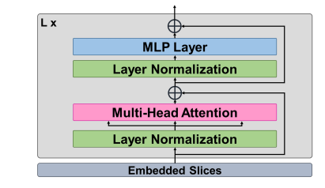

# M3T- three-dimensional Medical image classifier using Multi-plane and Multi-slice Transformer

# Overview
To develop a novel deep learning method to classify Alzheimer’s disease, Research paper can be accessed from the following link:
https://openaccess.thecvf.com/content/CVPR2022/papers/Jang_M3T_Three-Dimensional_Medical_Image_Classifier_Using_Multi-Plane_and_Multi-Slice_Transformer_CVPR_2022_paper.pdf

**If you use this code in your research, I kindly request you to cite my work. My work has a DOI and the related information can be found in the CITATION.cff file.**

Alzheimer’s : A type of brain disorder that causes problems with memory, thinking and behaviour


# M3T Network Architecture:


# Let's start coding each part of the architecture

**The model's architecture is divided into 3 parts:**

**1) 3D CNN block part**

**2) Extraction of Multi-plane, Multi slice images and  2D CNN block**

**3) Transformer encoder with classification head**


importing necessary libraries
>```
> import torch
> from torch import Tensor
> import torch.nn as nn
> import torchvision.models as models
> from einops import rearrange, reduce, repeat
> from einops.layers.torch import Rearrange, Reduce
> import torch.nn.functional as F

# 3D CNN block in M3T:
The authors mentioned that the shape of the output must match the shape of the input, the length, width and height of the output should be same as input

where I ∈ R^L×W×H , D3d : R^LxWxH -> R^C3xLxWxH

X = D3d(I), X ∈ R^C3d×L×W×H


>```
>class CNN3DBlock(nn.Module):
>     '''
>     To obtain 3D representation features, we apply 3D CNN block to the MRI image 
>     I ∈ R(L x W x H) where image length L, width W and height H are all the same.
>     X ∈ R(C3dxLxWxH)   where X = D3d(I)                                  Eq. (1)
>     Ref: 3.2. 3D Convolutional Neural Network Block 
>     '''
>     def __init__(self, in_channels, out_channels):
>         super(CNN3DBlock, self).__init__()
>
>         # 5 x 5 x 5 3D CNN
>         self.conv1 = nn.Conv3d(in_channels, out_channels, kernel_size=5, 
>                               stride=1, padding=2)
>         # Batch Normalization
>         self.bn1 = nn.BatchNorm3d(out_channels)
>
>         # ReLU
>         self.relu1 = nn.ReLU(inplace=True)
>
>         # 5 x 5 x 5 3D CNN
>         self.conv2 = nn.Conv3d(out_channels, out_channels, kernel_size=5, 
>                               stride=1, padding=2)
>       
>         # Batch Normalization
>         self.bn2 = nn.BatchNorm3d(out_channels)
>
>         # ReLU
>         self.relu2 = nn.ReLU(inplace=True)
>
>     def forward(self, x):
>         out = self.conv1(x)
>         out = self.bn1(out)
>         out = self.relu1(out)
> 
>         out = self.conv2(out)
>         out = self.bn2(out)
>         out = self.relu2(out)
>
>         return out


# Extraction of Multi-plane, Multi slice images and  2D CNN block in M3T:
After using 3D CNN block into the input image, the multi-plane and multi-slice image features is extracted from the 3D representation features X. The features are calculated from the extraction operator E. The
operator consists of coronal features extractor Ecor : R^C3d×L×W×H → R^C3d×N×W×H.

<table>
  <tr>
    <td></td>
    <td></td>
  </tr>
</table>

However, the authors did not mention what method they have used to achieve the above. This can be achieved by splitting and concatenating across the dimension or clone operation since height, width and depth are of same dimension. I'm not choosing the latter as it doesnot explain the intuition of extracting the features in different planes, but feel free to use clone operation in practice if splitting and concatenating along the same dimension may seem redundant:
>```
>class MultiPlane_MultiSlice_Extract_Project(nn.Module):
>     '''
>     The multi-plane and multi-slice image features extraction from the 3D 
>     representation features X and applying 2D CNN followed by Non-Linear
>     Projection
>     Ref: 3.3. Extraction of Multi-plane, Multi slice images and 
>          3.4. 2D Convolutional Neural Network Block
>     '''
>     def __init__(self, out_channels: int):
>         super(MultiPlane_MultiSlice_Extract_Project, self).__init__()
>
>     def forward(self, input_tensor):
>         # Extract coronal features
>         # The following code gives us a tuple of length 128, where each element has shape (batch_size, channels, 1, length, width)
>         coronal_slices = torch.split(input_tensor, 1, dim=2)         # Now we have 128 coronal images stored as tuple
>         Ecor = torch.cat(coronal_slices, dim=2)                      # lets concatenate along dimension 2 to get the desired output shape for Ecor: R^C3d×N×W×H.
>         return Ecor


We can get the axial and saggital features Esag, Eax using the above method. 

Now after extracting [Ecor, Esag and Eax] = E, **The authors calculated multi-plane multi-slice features S = [Scor, Ssag, Sax] using E = [Ecor, Esag, Eax] from 3D representation features X**. We can use basic matrix multiplication to achieve it. We will also complete the 2D CNN block part within this class:

>```
>class MultiPlane_MultiSlice_Extract_Project(nn.Module):
>     '''
>     The multi-plane and multi-slice image features extraction from the 3D 
>     representation features X and applying 2D CNN followed by Non-Linear
>     Projection
>     N = length = width = height based on the mentioned input size in the paper
>     Ref: 3.3. Extraction of Multi-plane, Multi slice images and 
>          3.4. 2D Convolutional Neural Network Block
>     '''
>     def __init__(self, out_channels: int):
>         super(MultiPlane_MultiSlice_Extract_Project, self).__init__()
>         # 2D CNN part
>         # Load the pre-trained ResNet-18 model and remove the fully connected layer to extract the processed features
>         self.CNN_2D = models.resnet50(weights=True)
>         self.CNN_2D.conv1 = nn.Conv2d(out_channels, 64, kernel_size=7, stride=2, padding=3, bias=False)
>         self.CNN_2D.fc = nn.Identity()
>
>         # Non - Linear Projection block
>         self.non_linear_proj = nn.Sequential(
>             nn.Linear(2048, 512),                                                 # Since the output features from average pooling layer of resnet50 model is 2048
>             nn.ReLU(),
>             nn.Linear(512, 256)
>             )
>
>     def forward(self, input_tensor):
>
>         B, C, D, H, W = input_tensor.shape
>
>         # Extract coronal features
>         coronal_slices = torch.split(input_tensor, 1, dim=2)                      # This gives us a tuple of length 128, where each element has shape (batch_size, channels, 1, width, height) 
>         Ecor = torch.cat(coronal_slices, dim=2)                                   # lets concatenate along dimension 2 to get the desired output shape for Ecor: R^C3d×N×W×H.
>
>         # Extract saggital features
>         saggital_slices = torch.split(input_tensor.clone(), 1, dim = 3)           # This gives us a tuple of length 128, where each element has shape (batch_size, channels, length, 1, height) 
>         Esag = torch.cat(saggital_slices, dim = 3)                                # lets concatenate along dimension 3 to get the desired output shape for Esag: R^C3d×L×N×H.
>
>         # Extract axial features
>         axial_slices = torch.split(input_tensor.clone(), 1, dim = 4)              # This gives us a tuple of length 128, where each element has shape (batch_size, channels, length, width, 1) 
>         Eax = torch.cat(axial_slices, dim = 4)                                    # lets concatenate along dimension 4 to get the desired output shape for Eax: R^C3d×L×W×N.
>
>         # Lets calculate S using E for X
>         # after matirx multiplications, we reshape the outputs based on its plane for concatenation 
>         Scor = (Ecor * input_tensor).permute(0, 2, 1, 3, 4).contiguous()          # Scor will now have a shape (batch_size, N, channels, width, height) 
>         Ssag = (Esag * input_tensor).permute(0, 3, 1, 2, 4).contiguous()          # Ssag will now have a shape (batch_size, N, channels, length, height)
>         Sax  =  (Eax * input_tensor).permute(0, 4, 1, 2, 3).contiguous()          # Sax will now have a shape  (batch_size, N, channels, length, width)
>        
>         # Concatenate the reshaped extracted features : R(C3d×L×W×H) → R(3N×C3d×L×L)
>         S = torch.cat((Scor, Ssag, Sax), dim = 1)                                 # Now S will have a shape of (batch_size, 3N, channels, length, length)
>
>         # 2D CNN block
>         # To use pre-trained ResNet50 network on input tensor of shape (), we must reshape the tensor
>         S = S.view(-1,C,H,W).contiguous()                                        # Now S will have a shape of (batch_size * 3N, channels, length, length)
>
>         # Now lets extract the features from the average pooling layer of the resnet model
>         # D2d : R(3N×C3d×L×L) → R(3N×C2d)    (C2d is out channel size of 2D CNN)
>         pooled_feat = self.CNN_2D(S).view(B, 3*H, -1)                            #  Eq. (4)
>
>         # Non-Linear Projection part T ∈ R(3N×d)     (d is projection dimension)
>         output_tensor = self.non_linear_proj(pooled_feat)                         # Now we have the desired output shape
>         return output_tensor


# Transformer encoder with classification head in M3T
After calculating the multi-plane and multi-slice image tokens, position and plane embedding tokens are added to the image tokens from non-linear projection layer. Lets check out all the tokens that we need.

**Position Embedding Tokens (Ppos):** The learnable one-dimensional tokens are applied to the embedding scheme to retain positional information.

**Plane Embedding Tokens (Ppln):** The learnable one-dimensional tokens are appliedto give information indicating which plane these tokens belong.

**CLS Token:** A learnable classification token is prepended to these tokens, similar to ViT class token.

**Plane separation tokens:** A learnable separation token appended between each plane token and the end of the tokens, similar to BERT sep token.


Lets implement them now:
>```
>class EmbeddingLayer(nn.Module):
>     '''
>     After calculating the multi-plane and multi-slice image tokens, position and 
>     plane embedding tokens are added to the image tokens from non-linear projection layer.
>     Ref. 3.5. Position and Plane Embedding Block
>     emb_size = d = 256, total_tokens = 3S = 3*128 = 384
>     where d = attention dimension and S = input size
>     '''
>     def __init__(self, emb_size: int = 256, total_tokens: int = 384):
>         super(EmbeddingLayer, self).__init__()
> 
>         # zcls ∈ R(d)
>         self.cls_token = nn.Parameter(torch.randn(1,1, emb_size))
>
>         # zsep ∈ R(d)
>         self.sep_token = nn.Parameter(torch.randn(1,1, emb_size))
>
>         # Ppln ∈ R((3S+4)×d)
>         # To inject plane-specific information to the model, we will use separate plane embeddings for different segments of the input tensor (refer, Fig.3(d))
>         self.coronal_plane = nn.Parameter(torch.randn(1, emb_size))
>         self.sagittal_plane = nn.Parameter(torch.randn(1, emb_size))
>         self.axial_plane = nn.Parameter(torch.randn(1, emb_size))
>
>         # Ppos ∈ R((3S+4)×d)
>         self.positions = nn.Parameter(torch.randn(total_tokens + 4, emb_size))
>
>     def forward(self, input_tensor):
>         b, _, _ = input_tensor.shape
>         cls_token = repeat(self.cls_token, '() n e -> b n e', b=b)
>         sep_token = repeat(self.sep_token, '() n e -> b n e', b=b)
>
>         x = torch.cat((cls_token, input_tensor[:, :128, :], sep_token, input_tensor[:, 128:256, :], sep_token, input_tensor[:, 256:, :], sep_token), dim=1)
>
>         x[:, :130] += self.coronal_plane
>         x[:, 130:259] += self.sagittal_plane
>         x[:, 259:] += self.axial_plane
>
>         x += self.positions
>        
>         # the above represents Eq. (6)
>         return x


**Now, the Transformer Block, if you have implemented ViT's, then it's a cake for you because its the same with little changes in dimensions**

**According to Implementation details in the paper, the authors mentioned that the number 256 is same with projection dimension (attention dimension) d used in the transformer. The number of transformer layers is 8. The hidden size and MLP size are 768, and the number of heads = 8.**





Lets keep that in mind, I will not explain each part of the transformer encoder, but you can check out the following link to understand in detail if needed: 
https://github.com/FrancescoSaverioZuppichini/ViT, We will be using 'cls_token' for classification task as mentioned in the original ViT paper 

>```
>class MultiHeadAttention(nn.Module):
>     def __init__(self, emb_size: int = 256, num_heads: int = 8, dropout: float = 0):
>         super().__init__()
>         self.emb_size = emb_size
>         self.num_heads = num_heads
>         # fuse the queries, keys and values in one matrix
>         self.qkv = nn.Linear(emb_size, emb_size * 3)
>         self.att_drop = nn.Dropout(dropout)
>         self.projection = nn.Linear(emb_size, emb_size)
>
>     def forward(self, x : Tensor, mask: Tensor = None) -> Tensor:
>         # split keys, queries and values in num_heads
>         qkv = rearrange(self.qkv(x), "b n (h d qkv) -> (qkv) b h n d", h=self.num_heads, qkv=3)
>         queries, keys, values = qkv[0], qkv[1], qkv[2]
>         # sum up over the last axis
>         energy = torch.einsum('bhqd, bhkd -> bhqk', queries, keys) # batch, num_heads, query_len, key_len
>         if mask is not None:
>             fill_value = torch.finfo(torch.float32).min
>             energy.mask_fill(~mask, fill_value)
>
>         scaling = self.emb_size ** (1/2)
>         att = F.softmax(energy, dim=-1) / scaling
>         att = self.att_drop(att)
>         # sum up over the third axis
>         out = torch.einsum('bhal, bhlv -> bhav ', att, values)
>         out = rearrange(out, "b h n d -> b n (h d)")
>         out = self.projection(out)
>         return out
>
>
>class ResidualAdd(nn.Module):
>     def __init__(self, fn):
>         super().__init__()
>         self.fn = fn
>
>     def forward(self, x, **kwargs):
>         res = x
>         x = self.fn(x, **kwargs)
>         x += res
>         return x
>
>
>class FeedForwardBlock(nn.Sequential):
>     def __init__(self, emb_size: int, expansion: int = 2, drop_p: float = 0.):
>         super().__init__(
>             nn.Linear(emb_size, expansion * emb_size),
>             nn.GELU(),
>             nn.Dropout(drop_p),
>             nn.Linear(expansion * emb_size, emb_size),
>         )
>
>
>
>class TransformerEncoderBlock(nn.Sequential):
>     '''
>     We keep the forward expansion as 3, since all the hidden and MLP sizes must be 768 in the transformer encoder
>     Ref. 3.6. Transformer Block
>     '''
>     def __init__(self,
>                  emb_size: int = 256,
>                  drop_p: float = 0.,
>                  forward_expansion: int = 2,
>                  forward_drop_p: float = 0.,
>                  ** kwargs):
>         super().__init__(
>             # Zk = MSA(LN(Zk)) + Zk                                      Eq. (7)
>             ResidualAdd(nn.Sequential(
>                 # Layer Normalization (LN)
>                 nn.LayerNorm(emb_size),
>
>                 # Multi Head Self attention (MSA)
>                 MultiHeadAttention(emb_size, **kwargs),
>                 nn.Dropout(drop_p)
>             )),
>             # Zk+1 = MLP(LN(Zk))+ Zk                                     Eq. (8)
>             ResidualAdd(nn.Sequential(
>                 # MLP blocks
>                 nn.LayerNorm(emb_size),
>                 FeedForwardBlock(
>                     emb_size, expansion=forward_expansion, drop_p=forward_drop_p),
>                 nn.Dropout(drop_p)
>             )
>             ))
>
>
>class TransformerEncoder(nn.Sequential):
>     '''
>     The number 256 is same with projection dimension (attention dimension) d used in the transformer.
>     The number of transformer layers is 8. The hidden size and MLP size are 768, 
>     and the number of heads = 8.
>     '''
>     def __init__(self, depth: int = 8, **kwargs):
>         super().__init__(*[TransformerEncoderBlock(**kwargs) for _ in range(depth)])
>
>
>class ClassificationHead(nn.Module):
>    '''
>    A linear classifier is used to classify the encoded input based on the MLP 
>    head: ZKcls ∈ R(d). There are two final categorization classes: NC and AD.
>    The first token (cls_token) from the sequence is used for classification.
>    '''
>    def __init__(self, emb_size: int = 256, n_classes: int = 2):
>        super().__init__()
>        self.linear = nn.Linear(emb_size, n_classes)
>
>    def forward(self, x):
>        # As x is of shape [batch_size, num_tokens, emb_size]
>        # and the cls_token is the first token in the sequence
>        cls_token = x[:, 0]
>        return self.linear(cls_token)


**We have covered each and every part in the M3T. Lets give a final touch by calling them:**
>```
>class M3T(nn.Sequential):
>     def __init__(self,
>                 in_channels: int = 1,
>                 out_channels: int = 32,
>                 emb_size: int = 256,
>                 depth: int = 8,
>                 n_classes: int = 2,
>                 **kwargs):
>         super().__init__(
>             CNN3DBlock(in_channels, out_channels),
>             MultiPlane_MultiSlice_Extract_Project(out_channels),
>             EmbeddingLayer(emb_size=emb_size),
>             TransformerEncoder(depth, emb_size=emb_size, **kwargs),
>             ClassificationHead(emb_size, n_classes)
>         )

You can find the complete implementation of M3T in M3T.py file. Now lets test the M3T using ```torchsummary``` to check the number of parameters
>```
>from torchsummary import summary
>model = M3T()
>summary(model, (1, 128, 128, 128))

>```
>----------------------------------------------------------------
>        Layer (type)               Output Shape         Param #
>================================================================
>            Conv3d-1    [-1, 32, 128, 128, 128]           4,032
>       BatchNorm3d-2    [-1, 32, 128, 128, 128]              64
>              ReLU-3    [-1, 32, 128, 128, 128]               0
>            Conv3d-4    [-1, 32, 128, 128, 128]         128,032
>       BatchNorm3d-5    [-1, 32, 128, 128, 128]              64
>              ReLU-6    [-1, 32, 128, 128, 128]               0
>        CNN3DBlock-7    [-1, 32, 128, 128, 128]               0
>            Conv2d-8           [-1, 64, 64, 64]         100,352
>       BatchNorm2d-9           [-1, 64, 64, 64]             128
>             ReLU-10           [-1, 64, 64, 64]               0
>        MaxPool2d-11           [-1, 64, 32, 32]               0
>           Conv2d-12           [-1, 64, 32, 32]           4,096
>      BatchNorm2d-13           [-1, 64, 32, 32]             128
>             ReLU-14           [-1, 64, 32, 32]               0
>           Conv2d-15           [-1, 64, 32, 32]          36,864
>      BatchNorm2d-16           [-1, 64, 32, 32]             128
>             ReLU-17           [-1, 64, 32, 32]               0
>           Conv2d-18          [-1, 256, 32, 32]          16,384
>      BatchNorm2d-19          [-1, 256, 32, 32]             512
>           Conv2d-20          [-1, 256, 32, 32]          16,384
>      BatchNorm2d-21          [-1, 256, 32, 32]             512
>             ReLU-22          [-1, 256, 32, 32]               0
>       Bottleneck-23          [-1, 256, 32, 32]               0
>           Conv2d-24           [-1, 64, 32, 32]          16,384
>      BatchNorm2d-25           [-1, 64, 32, 32]             128
>             ReLU-26           [-1, 64, 32, 32]               0
>           Conv2d-27           [-1, 64, 32, 32]          36,864
>      BatchNorm2d-28           [-1, 64, 32, 32]             128
>             ReLU-29           [-1, 64, 32, 32]               0
>           Conv2d-30          [-1, 256, 32, 32]          16,384
>      BatchNorm2d-31          [-1, 256, 32, 32]             512
>             ReLU-32          [-1, 256, 32, 32]               0
>       Bottleneck-33          [-1, 256, 32, 32]               0
>           Conv2d-34           [-1, 64, 32, 32]          16,384
>      BatchNorm2d-35           [-1, 64, 32, 32]             128
>             ReLU-36           [-1, 64, 32, 32]               0
>           Conv2d-37           [-1, 64, 32, 32]          36,864
>      BatchNorm2d-38           [-1, 64, 32, 32]             128
>             ReLU-39           [-1, 64, 32, 32]               0
>           Conv2d-40          [-1, 256, 32, 32]          16,384
>      BatchNorm2d-41          [-1, 256, 32, 32]             512
>             ReLU-42          [-1, 256, 32, 32]               0
>       Bottleneck-43          [-1, 256, 32, 32]               0
>           Conv2d-44          [-1, 128, 32, 32]          32,768
>      BatchNorm2d-45          [-1, 128, 32, 32]             256
>             ReLU-46          [-1, 128, 32, 32]               0
>           Conv2d-47          [-1, 128, 16, 16]         147,456
>      BatchNorm2d-48          [-1, 128, 16, 16]             256
>             ReLU-49          [-1, 128, 16, 16]               0
>           Conv2d-50          [-1, 512, 16, 16]          65,536
>      BatchNorm2d-51          [-1, 512, 16, 16]           1,024
>           Conv2d-52          [-1, 512, 16, 16]         131,072
>      BatchNorm2d-53          [-1, 512, 16, 16]           1,024
>             ReLU-54          [-1, 512, 16, 16]               0
>      Bottleneck-55          [-1, 512, 16, 16]               0
>           Conv2d-56          [-1, 128, 16, 16]          65,536
>      BatchNorm2d-57          [-1, 128, 16, 16]             256
>             ReLU-58          [-1, 128, 16, 16]               0
>           Conv2d-59          [-1, 128, 16, 16]         147,456
>      BatchNorm2d-60          [-1, 128, 16, 16]             256
>             ReLU-61          [-1, 128, 16, 16]               0
>           Conv2d-62          [-1, 512, 16, 16]          65,536
>      BatchNorm2d-63          [-1, 512, 16, 16]           1,024
>             ReLU-64          [-1, 512, 16, 16]               0
>       Bottleneck-65          [-1, 512, 16, 16]               0
>           Conv2d-66          [-1, 128, 16, 16]          65,536
>      BatchNorm2d-67          [-1, 128, 16, 16]             256
>             ReLU-68          [-1, 128, 16, 16]               0
>           Conv2d-69          [-1, 128, 16, 16]         147,456
>      BatchNorm2d-70          [-1, 128, 16, 16]             256
>             ReLU-71          [-1, 128, 16, 16]               0
>           Conv2d-72          [-1, 512, 16, 16]          65,536
>      BatchNorm2d-73          [-1, 512, 16, 16]           1,024
>             ReLU-74          [-1, 512, 16, 16]               0
>       Bottleneck-75          [-1, 512, 16, 16]               0
>           Conv2d-76          [-1, 128, 16, 16]          65,536
>      BatchNorm2d-77          [-1, 128, 16, 16]             256
>             ReLU-78          [-1, 128, 16, 16]               0
>           Conv2d-79          [-1, 128, 16, 16]         147,456
>      BatchNorm2d-80          [-1, 128, 16, 16]             256
>             ReLU-81          [-1, 128, 16, 16]               0
>           Conv2d-82          [-1, 512, 16, 16]          65,536
>      BatchNorm2d-83          [-1, 512, 16, 16]           1,024
>             ReLU-84          [-1, 512, 16, 16]               0
>       Bottleneck-85          [-1, 512, 16, 16]               0
>           Conv2d-86          [-1, 256, 16, 16]         131,072
>      BatchNorm2d-87          [-1, 256, 16, 16]             512
>             ReLU-88          [-1, 256, 16, 16]               0
>           Conv2d-89            [-1, 256, 8, 8]         589,824
>      BatchNorm2d-90            [-1, 256, 8, 8]             512
>             ReLU-91            [-1, 256, 8, 8]               0
>           Conv2d-92           [-1, 1024, 8, 8]         262,144
>      BatchNorm2d-93           [-1, 1024, 8, 8]           2,048
>           Conv2d-94           [-1, 1024, 8, 8]         524,288
>      BatchNorm2d-95           [-1, 1024, 8, 8]           2,048
>             ReLU-96           [-1, 1024, 8, 8]               0
>       Bottleneck-97           [-1, 1024, 8, 8]               0
>           Conv2d-98            [-1, 256, 8, 8]         262,144
>      BatchNorm2d-99            [-1, 256, 8, 8]             512
>            ReLU-100            [-1, 256, 8, 8]               0
>          Conv2d-101            [-1, 256, 8, 8]         589,824
>     BatchNorm2d-102            [-1, 256, 8, 8]             512
>            ReLU-103            [-1, 256, 8, 8]               0
>          Conv2d-104           [-1, 1024, 8, 8]         262,144
>     BatchNorm2d-105           [-1, 1024, 8, 8]           2,048
>            ReLU-106           [-1, 1024, 8, 8]               0
>      Bottleneck-107           [-1, 1024, 8, 8]               0
>          Conv2d-108            [-1, 256, 8, 8]         262,144
>     BatchNorm2d-109            [-1, 256, 8, 8]             512
>            ReLU-110            [-1, 256, 8, 8]               0
>          Conv2d-111            [-1, 256, 8, 8]         589,824
>     BatchNorm2d-112            [-1, 256, 8, 8]             512
>            ReLU-113            [-1, 256, 8, 8]               0
>          Conv2d-114           [-1, 1024, 8, 8]         262,144
>     BatchNorm2d-115           [-1, 1024, 8, 8]           2,048
>            ReLU-116           [-1, 1024, 8, 8]               0
>      Bottleneck-117           [-1, 1024, 8, 8]               0
>          Conv2d-118            [-1, 256, 8, 8]         262,144
>     BatchNorm2d-119            [-1, 256, 8, 8]             512
>            ReLU-120            [-1, 256, 8, 8]               0
>          Conv2d-121            [-1, 256, 8, 8]         589,824
>     BatchNorm2d-122            [-1, 256, 8, 8]             512
>            ReLU-123            [-1, 256, 8, 8]               0
>          Conv2d-124           [-1, 1024, 8, 8]         262,144
>     BatchNorm2d-125           [-1, 1024, 8, 8]           2,048
>            ReLU-126           [-1, 1024, 8, 8]               0
>      Bottleneck-127           [-1, 1024, 8, 8]               0
>          Conv2d-128            [-1, 256, 8, 8]         262,144
>     BatchNorm2d-129            [-1, 256, 8, 8]             512
>            ReLU-130            [-1, 256, 8, 8]               0
>          Conv2d-131            [-1, 256, 8, 8]         589,824
>     BatchNorm2d-132            [-1, 256, 8, 8]             512
>            ReLU-133            [-1, 256, 8, 8]               0
>          Conv2d-134           [-1, 1024, 8, 8]         262,144
>     BatchNorm2d-135           [-1, 1024, 8, 8]           2,048
>            ReLU-136           [-1, 1024, 8, 8]               0
>      Bottleneck-137           [-1, 1024, 8, 8]               0
>          Conv2d-138            [-1, 256, 8, 8]         262,144
>     BatchNorm2d-139            [-1, 256, 8, 8]             512
>            ReLU-140            [-1, 256, 8, 8]               0
>          Conv2d-141            [-1, 256, 8, 8]         589,824
>     BatchNorm2d-142            [-1, 256, 8, 8]             512
>            ReLU-143            [-1, 256, 8, 8]               0
>          Conv2d-144           [-1, 1024, 8, 8]         262,144
>     BatchNorm2d-145           [-1, 1024, 8, 8]           2,048
>            ReLU-146           [-1, 1024, 8, 8]               0
>      Bottleneck-147           [-1, 1024, 8, 8]               0
>          Conv2d-148            [-1, 512, 8, 8]         524,288
>     BatchNorm2d-149            [-1, 512, 8, 8]           1,024
>            ReLU-150            [-1, 512, 8, 8]               0
>          Conv2d-151            [-1, 512, 4, 4]       2,359,296
>     BatchNorm2d-152            [-1, 512, 4, 4]           1,024
>            ReLU-153            [-1, 512, 4, 4]               0
>          Conv2d-154           [-1, 2048, 4, 4]       1,048,576
>     BatchNorm2d-155           [-1, 2048, 4, 4]           4,096
>          Conv2d-156           [-1, 2048, 4, 4]       2,097,152
>     BatchNorm2d-157           [-1, 2048, 4, 4]           4,096
>            ReLU-158           [-1, 2048, 4, 4]               0
>      Bottleneck-159           [-1, 2048, 4, 4]               0
>          Conv2d-160            [-1, 512, 4, 4]       1,048,576
>     BatchNorm2d-161            [-1, 512, 4, 4]           1,024
>            ReLU-162            [-1, 512, 4, 4]               0
>          Conv2d-163            [-1, 512, 4, 4]       2,359,296
>     BatchNorm2d-164            [-1, 512, 4, 4]           1,024
>            ReLU-165            [-1, 512, 4, 4]               0
>          Conv2d-166           [-1, 2048, 4, 4]       1,048,576
>     BatchNorm2d-167           [-1, 2048, 4, 4]           4,096
>            ReLU-168           [-1, 2048, 4, 4]               0
>      Bottleneck-169           [-1, 2048, 4, 4]               0
>          Conv2d-170            [-1, 512, 4, 4]       1,048,576
>     BatchNorm2d-171            [-1, 512, 4, 4]           1,024
>            ReLU-172            [-1, 512, 4, 4]               0
>          Conv2d-173            [-1, 512, 4, 4]       2,359,296
>     BatchNorm2d-174            [-1, 512, 4, 4]           1,024
>            ReLU-175            [-1, 512, 4, 4]               0
>          Conv2d-176           [-1, 2048, 4, 4]       1,048,576
>     BatchNorm2d-177           [-1, 2048, 4, 4]           4,096
>            ReLU-178           [-1, 2048, 4, 4]               0
>      Bottleneck-179           [-1, 2048, 4, 4]               0
> AdaptiveAvgPool2d-180           [-1, 2048, 1, 1]               0
>        Identity-181                 [-1, 2048]               0
>          ResNet-182                 [-1, 2048]               0
>          Linear-183             [-1, 384, 512]       1,049,088
>            ReLU-184             [-1, 384, 512]               0
>          Linear-185             [-1, 384, 256]         131,328
>MultiPlane_MultiSlice_Extract_Project-186             [-1, 384, 256]               0
>  EmbeddingLayer-187             [-1, 388, 256]               0
>       LayerNorm-188             [-1, 388, 256]             512
>          Linear-189             [-1, 388, 768]         197,376
>         Dropout-190          [-1, 8, 388, 388]               0
>          Linear-191             [-1, 388, 256]          65,792
>MultiHeadAttention-192             [-1, 388, 256]               0
>         Dropout-193             [-1, 388, 256]               0
>     ResidualAdd-194             [-1, 388, 256]               0
>       LayerNorm-195             [-1, 388, 256]             512
>          Linear-196             [-1, 388, 512]         131,584
>            GELU-197             [-1, 388, 512]               0
>         Dropout-198             [-1, 388, 512]               0
>          Linear-199             [-1, 388, 256]         131,328
>         Dropout-200             [-1, 388, 256]               0
>     ResidualAdd-201             [-1, 388, 256]               0
>       LayerNorm-202             [-1, 388, 256]             512
>          Linear-203             [-1, 388, 768]         197,376
>         Dropout-204          [-1, 8, 388, 388]               0
>          Linear-205             [-1, 388, 256]          65,792
>MultiHeadAttention-206             [-1, 388, 256]               0
>         Dropout-207             [-1, 388, 256]               0
>     ResidualAdd-208             [-1, 388, 256]               0
>       LayerNorm-209             [-1, 388, 256]             512
>          Linear-210             [-1, 388, 512]         131,584
>            GELU-211             [-1, 388, 512]               0
>         Dropout-212             [-1, 388, 512]               0
>          Linear-213             [-1, 388, 256]         131,328
>         Dropout-214             [-1, 388, 256]               0
>     ResidualAdd-215             [-1, 388, 256]               0
>       LayerNorm-216             [-1, 388, 256]             512
>          Linear-217             [-1, 388, 768]         197,376
>         Dropout-218          [-1, 8, 388, 388]               0
>          Linear-219             [-1, 388, 256]          65,792
>MultiHeadAttention-220             [-1, 388, 256]               0
>         Dropout-221             [-1, 388, 256]               0
>     ResidualAdd-222             [-1, 388, 256]               0
>       LayerNorm-223             [-1, 388, 256]             512
>          Linear-224             [-1, 388, 512]         131,584
>            GELU-225             [-1, 388, 512]               0
>         Dropout-226             [-1, 388, 512]               0
>          Linear-227             [-1, 388, 256]         131,328
>         Dropout-228             [-1, 388, 256]               0
>     ResidualAdd-229             [-1, 388, 256]               0
>       LayerNorm-230             [-1, 388, 256]             512
>          Linear-231             [-1, 388, 768]         197,376
>         Dropout-232          [-1, 8, 388, 388]               0
>          Linear-233             [-1, 388, 256]          65,792
>MultiHeadAttention-234             [-1, 388, 256]               0
>         Dropout-235             [-1, 388, 256]               0
>     ResidualAdd-236             [-1, 388, 256]               0
>       LayerNorm-237             [-1, 388, 256]             512
>          Linear-238             [-1, 388, 512]         131,584
>            GELU-239             [-1, 388, 512]               0
>         Dropout-240             [-1, 388, 512]               0
>          Linear-241             [-1, 388, 256]         131,328
>         Dropout-242             [-1, 388, 256]               0
>     ResidualAdd-243             [-1, 388, 256]               0
>       LayerNorm-244             [-1, 388, 256]             512
>          Linear-245             [-1, 388, 768]         197,376
>         Dropout-246          [-1, 8, 388, 388]               0
>          Linear-247             [-1, 388, 256]          65,792
>MultiHeadAttention-248             [-1, 388, 256]               0
>         Dropout-249             [-1, 388, 256]               0
>     ResidualAdd-250             [-1, 388, 256]               0
>       LayerNorm-251             [-1, 388, 256]             512
>          Linear-252             [-1, 388, 512]         131,584
>            GELU-253             [-1, 388, 512]               0
>         Dropout-254             [-1, 388, 512]               0
>          Linear-255             [-1, 388, 256]         131,328
>         Dropout-256             [-1, 388, 256]               0
>     ResidualAdd-257             [-1, 388, 256]               0
>       LayerNorm-258             [-1, 388, 256]             512
>          Linear-259             [-1, 388, 768]         197,376
>         Dropout-260          [-1, 8, 388, 388]               0
>          Linear-261             [-1, 388, 256]          65,792
>MultiHeadAttention-262             [-1, 388, 256]               0
>         Dropout-263             [-1, 388, 256]               0
>     ResidualAdd-264             [-1, 388, 256]               0
>       LayerNorm-265             [-1, 388, 256]             512
>          Linear-266             [-1, 388, 512]         131,584
>            GELU-267             [-1, 388, 512]               0
>         Dropout-268             [-1, 388, 512]               0
>          Linear-269             [-1, 388, 256]         131,328
>         Dropout-270             [-1, 388, 256]               0
>     ResidualAdd-271             [-1, 388, 256]               0
>       LayerNorm-272             [-1, 388, 256]             512
>          Linear-273             [-1, 388, 768]         197,376
>         Dropout-274          [-1, 8, 388, 388]               0
>          Linear-275             [-1, 388, 256]          65,792
>MultiHeadAttention-276             [-1, 388, 256]               0
>         Dropout-277             [-1, 388, 256]               0
>     ResidualAdd-278             [-1, 388, 256]               0
>       LayerNorm-279             [-1, 388, 256]             512
>          Linear-280             [-1, 388, 512]         131,584
>            GELU-281             [-1, 388, 512]               0
>         Dropout-282             [-1, 388, 512]               0
>          Linear-283             [-1, 388, 256]         131,328
>         Dropout-284             [-1, 388, 256]               0
>     ResidualAdd-285             [-1, 388, 256]               0
>       LayerNorm-286             [-1, 388, 256]             512
>          Linear-287             [-1, 388, 768]         197,376
>         Dropout-288          [-1, 8, 388, 388]               0
>          Linear-289             [-1, 388, 256]          65,792
>MultiHeadAttention-290             [-1, 388, 256]               0
>         Dropout-291             [-1, 388, 256]               0
>     ResidualAdd-292             [-1, 388, 256]               0
>       LayerNorm-293             [-1, 388, 256]             512
>          Linear-294             [-1, 388, 512]         131,584
>            GELU-295             [-1, 388, 512]               0
>         Dropout-296             [-1, 388, 512]               0
>          Linear-297             [-1, 388, 256]         131,328
>         Dropout-298             [-1, 388, 256]               0
>     ResidualAdd-299             [-1, 388, 256]               0
>          Linear-300                    [-1, 2]             514
>ClassificationHead-301                    [-1, 2]               0
>================================================================
>Total params: 29,128,930
>Trainable params: 29,128,930
>Non-trainable params: 0
>----------------------------------------------------------------
>Input size (MB): 8.00
>Forward/backward pass size (MB): 3865.50
>Params size (MB): 111.12
>Estimated Total Size (MB): 3984.62
>----------------------------------------------------------------


We can see that the number of parameters that I got here is same as it was mentioned in the paper. I have got **29.12M trainable parameters** with torch summary. 

I have diligently followed each step in implementing M3T with utmost care and attention to detail.

Thank you.

Vishnu 

